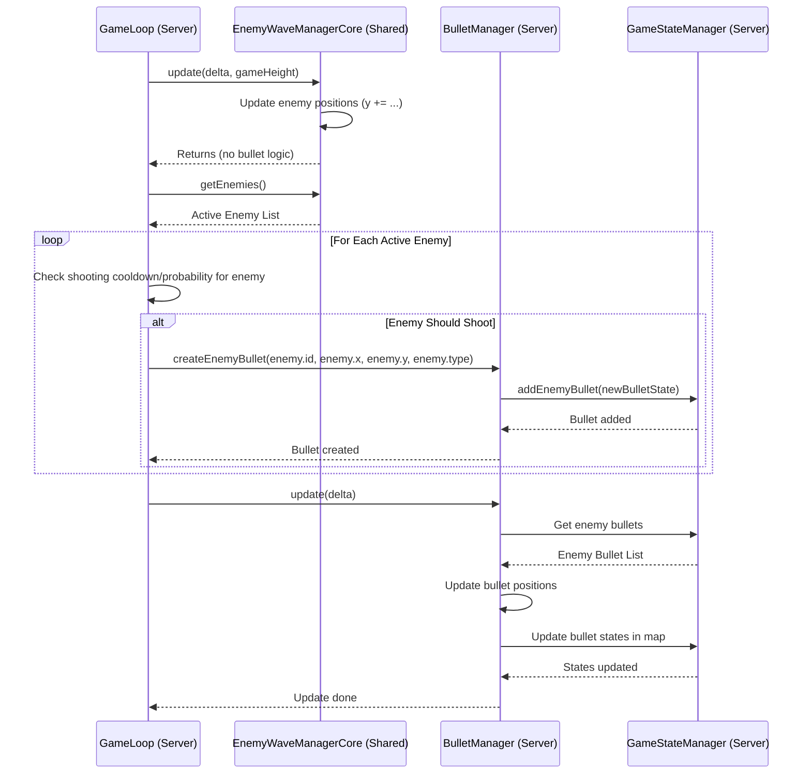

# Implementation Plan 44: Post-Refactor Bug Fixes

## 1. Goal

Address several bugs observed after recent refactoring efforts:
1.  Player HUD shows 0 lives initially.
2.  Enemy sprites appear very large.
3.  Enemies do not shoot bullets (or bullets are not visible/effective).
4.  Potential game logic issue causing enemies to repeatedly reach the bottom and reset while players are invincible.

## 2. Analysis & Findings

*   **Player Lives:** The server correctly sets initial lives (`PLAYER_INITIAL_LIVES = 3`), but the client-side `ClientStateManager.ts` fails to update the `GameHUD` with the received value. A `TODO` comment confirms this omission.
*   **Enemy Size:** No explicit scaling (`setScale`) is applied in `ClientEnemyManager.ts` or the `Enemy.ts` base/subclasses. The large size likely stems from the original SVG asset dimensions. Scaling needs to be added client-side.
*   **Enemy Shooting:** Firing decision logic and bullet creation are incorrectly located in the shared `EnemyWaveManagerCore.ts`. Bullets created there are not registered with the authoritative server `BulletManager.ts` and thus have no effect. The logic must be moved server-side.
*   **Reset Loop:** Server logs indicate enemies reach the bottom and reset due to player invincibility. This might be correct behavior if players remain invincible, but could also indicate flaws in the game over check (`GameLoop.ts`), invincibility state management (`PlayerManager.ts`), or enemy speed/spawn constants.

## 3. Implementation Plan

1.  **Fix Player Lives Display:**
    *   **File:** `src/managers/ClientStateManager.ts`
    *   **Action:** In the `updateUI` method (or `reconcilePlayers`), add logic to get the local player's state from `newState.players` and call `this.gameHUD.updateLives(localPlayerState.lives)`. Remove the `TODO` comment.

2.  **Fix Enemy Size:**
    *   **Files:** `src/enemies/NormalEnemy.ts`, `src/enemies/FalconEnemy.ts`
    *   **Action:** Add `this.sprite.setScale(0.8);` (or similar value, adjust based on visual testing) within the `constructor` of both `NormalEnemy` and `FalconEnemy` after the `super()` call.

3.  **Fix Enemy Shooting Logic:**
    *   **Step 3a: Remove Misplaced Logic:**
        *   **File:** `src/shared/EnemyWaveManagerCore.ts`
        *   **Action:** Remove properties (`enemyBullets`, `nextBulletId`, `bulletSpawnTimer`, `bulletSpawnInterval`), the `spawnEnemyBullet` method, and related logic from the `update` method.
    *   **Step 3b: Implement Server-Side Shooting:**
        *   **File:** `server/src/GameLoop.ts`
        *   **Action:**
            *   Inject `BulletManager` via the constructor.
            *   In `tick()`, after `this.enemyWaveManager.update()`, add logic:
                *   Get active enemies: `const activeEnemies = this.enemyWaveManager.getEnemies().filter(e => e.active);`
                *   Implement cooldown/probability checks (e.g., using a `Map<EnemyId, number>` for last shot times, and constants from `shared/constants.ts`).
                *   If an enemy should fire: `this.bulletManager.createEnemyBullet(enemy.id, enemy.x, enemy.y, enemy.type);`

4.  **Investigate/Address Reset Loop:**
    *   **Step 4a: Review Game Over Logic:**
        *   **File:** `server/src/GameLoop.ts`
        *   **Action:** Verify the "enemy reached bottom" check correctly uses `this.playerManager.getAllPlayers().filter(p => p.isActive).every(p => p.isInvincible)`. Correct if necessary.
    *   **Step 4b: Review Invincibility State:**
        *   **File:** `server/src/PlayerManager.ts`
        *   **Action:** Double-check that the `isInvincible` state can be toggled off correctly and isn't stuck `true`.
    *   **Step 4c: Review Enemy Speed/Spawning:**
        *   **Files:** `src/shared/constants.ts`, `src/shared/EnemyWaveManagerCore.ts`
        *   **Action:** Review `ENEMY_NORMAL_SPEED`, `ENEMY_FALCON_SPEED`, the movement multiplier in `update()`, and `offsetY` in `startWave()`. Adjust if enemies move too fast or start too low.

## 4. Diagram (Enemy Shooting Fix)

## 5. Next Steps

*   Switch to Code mode to implement these changes.
*   Test thoroughly after implementation.