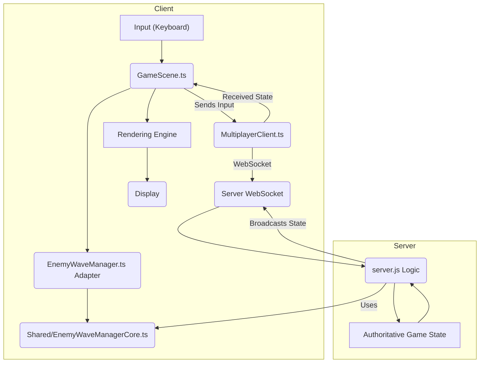
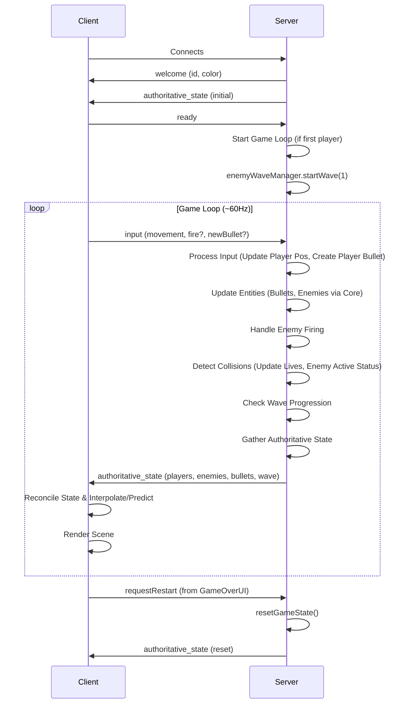
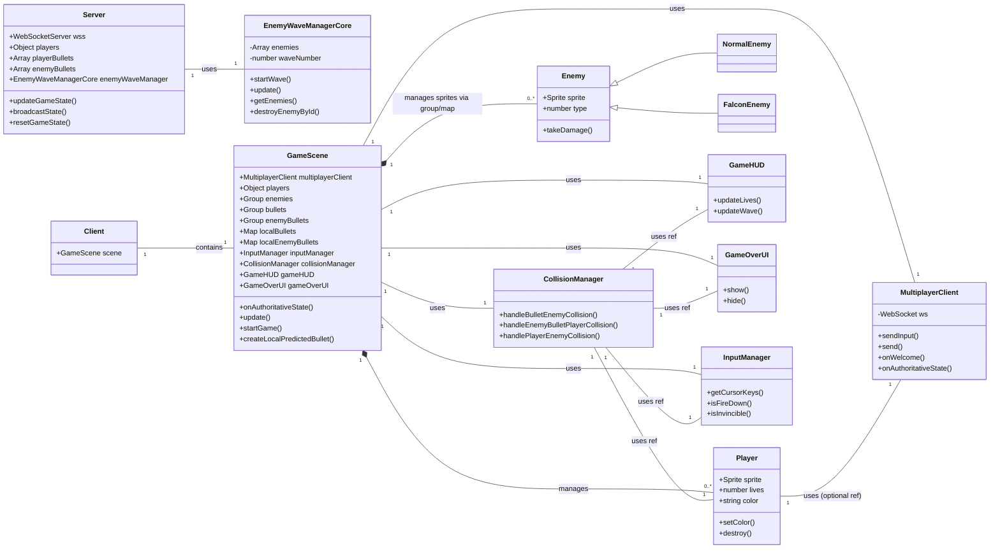

# Comprehensive Game Documentation: Multiplayer Arcade Space Shooter

## 1. Introduction

This document provides comprehensive documentation for the multiplayer arcade space shooter project. It details the game's core functionality, technical architecture, current implementation state, and known issues. The project began as a single-player game and evolved into a real-time multiplayer experience featuring a server-authoritative architecture, ensuring consistency and fairness across all connected clients.

## 2. Core Gameplay

*   **Concept:** A top-down space shooter inspired by classic arcade games.
*   **Player Control:** Players control individual ships, moving horizontally and vertically, and firing projectiles upwards. Input is sent to the server, which determines the authoritative position.
*   **Enemies:** Two primary enemy types exist: NormalEnemy (Type 1) and FalconEnemy (Type 2).
*   **Waves:** Enemies appear in predefined waves, spawned and moved authoritatively by the server.
*   **Objective:** Survive incoming enemy waves and projectiles for as long as possible.
*   **Game Over/Restart:** The game ends when a player loses all their lives (currently tracked per player on the server). Players can request a game restart via the Game Over UI, which triggers a server-side state reset.

## 3. Architecture

### 3.1 Server-Authoritative Model Overview

The game employs a server-authoritative architecture. The Node.js server (`server/server.js`) acts as the single source of truth for all critical game state and logic. Clients (`src/scenes/GameScene.ts`) primarily send input to the server and render the game world based on the state updates received from the server. Shared, framework-agnostic logic for enemy wave management is located in `src/shared/EnemyWaveManagerCore.ts`.

Mermaid Code (Architecture Overview)

### 3.2 Server Responsibilities (`server/server.js`)

*   Manages WebSocket connections.
*   Assigns unique IDs and colors to connecting players.
*   Maintains the authoritative state: `players`, `playerBullets`, `enemyBullets`, enemy state (via `EnemyWaveManagerCore`), `waveNumber`.
*   Listens for client messages: `input` (movement/firing), `ready` (to start game), `requestRestart`.
*   Runs a fixed-tick game loop (`updateGameState` at ~60Hz):
    *   Updates player positions based on last received input.
    *   Creates player bullets based on `fire` input and client-provided details (ID, position, velocity).
    *   Updates all bullet positions (player and enemy) and removes out-of-bounds bullets.
    *   Updates enemy state (position, visibility) via `EnemyWaveManagerCore.update()`.
    *   Handles enemy firing logic (Normal and Falcon types).
    *   Performs all collision detection (Player Bullet vs Enemy, Enemy Bullet vs Player, Enemy vs Player) using AABB checks.
    *   Updates entity states based on collisions (player lives, enemy active status).
    *   Handles wave progression via `EnemyWaveManagerCore`.
*   Broadcasts the complete `authoritativeState` to all clients regularly.
*   Handles game state resets on `requestRestart`.

### 3.3 Client Responsibilities (`src/scenes/GameScene.ts`)

*   Connects to the server via WebSocket (`MultiplayerClient`).
*   Sends `ready` message after splash screen.
*   Sends `input` messages (movement state, fire state, predicted bullet details) to the server on user interaction.
*   Receives `authoritativeState` messages from the server.
*   Reconciles local game objects with the server state:
    *   Creates/updates/destroys player sprites (interpolating remote players, directly setting local player).
    *   Creates/updates/destroys enemy sprites (interpolating movement).
    *   Reconciles player bullets (correcting predicted bullets, creating/destroying others).
    *   Reconciles enemy bullets (creating/updating/destroying).
*   Renders the game world based on the reconciled state.
*   Updates UI elements (`GameHUD`) based on received state.
*   Displays `GameOverUI` based on local player lives (updated by `CollisionManager` based on local detection, though authoritative lives come from server) and sends `requestRestart` on button click.
*   Manages client-side managers (`InputManager`, `CollisionManager`, `EnemyWaveManager` adapter, `GameHUD`, `GameOverUI`).
*   Handles client-side prediction for locally fired bullets.

### 3.4 Shared Logic (`src/shared/EnemyWaveManagerCore.ts`)

*   Framework-agnostic TypeScript class.
*   Manages the core state and logic for enemy waves.
*   `startWave`: Spawns enemies in a grid formation with unique IDs and random types.
*   `update`: Moves active enemies vertically, updates their `visible` status based on position. (Note: Server `server.js` contains the actual enemy firing logic).
*   `destroyEnemyById`: Marks an enemy as inactive.
*   Used directly by the server for simulation.
*   Instantiated by the client's `EnemyWaveManager` adapter (though the adapter's update/spawn methods are largely bypassed in favor of server state).

### 3.5 Data Flow / Communication Protocol

Mermaid Code (Data Flow)

### 3.6 Class Relationships (Simplified)

Mermaid Code (Class Relationships)

## 4. Key Components & Logic

### 4.1 Player

| Feature          | Description                                                                                                                               | Location(s)                                     |
| :--------------- | :---------------------------------------------------------------------------------------------------------------------------------------- | :---------------------------------------------- |
| **Sprite**       |  Represents the player ship.                                                                      | `assets/player_ship.svg`                        |
| **State (Server)** | `id`, `color`, `x`, `y`, `lives`, `velocityX`, `velocityY`, `lastInputTime`, `input`, `lastShotTime`. Managed in `server.js` `players` object. | `server.js`                                     |
| **Rendering (Client)** | Sprite created/updated in `GameScene` based on server state. Remote players interpolated, local player position set directly. Color fallback for dark colors. | `src/player/Player.ts`, `src/scenes/GameScene.ts` |
| **Input**        | Client (`InputManager`, `GameScene`) captures keyboard input and sends `input` message via `MultiplayerClient`.                            | `src/managers/InputManager.ts`, `src/scenes/GameScene.ts` |
| **Movement**     | Server (`server.js`) updates `x`, `y` based on last received `input` state and `PLAYER_SPEED` (200). Client interpolates remote players.      | `server.js`, `src/scenes/GameScene.ts`          |
| **Shooting**     | Client predicts bullet locally (`createLocalPredictedBullet`), sends details in `input` message. Server creates bullet authoritatively, applies cooldown (300ms). Bullet speed `BULLET_SPEED` (400). | `src/scenes/GameScene.ts`, `server.js`          |
| **Collision**    | Server (`server.js`) detects collisions with enemy bullets and enemies, decrements `lives`. Client (`CollisionManager`) shows local effects. | `server.js`, `src/managers/CollisionManager.ts` |

### 4.2 Enemies

#### 4.2.1 NormalEnemy (Type 1)

| Feature          | Description                                                                                                                               | Location(s)                                     |
| :--------------- | :---------------------------------------------------------------------------------------------------------------------------------------- | :---------------------------------------------- |
| **Sprite**       |  Standard enemy ship.                                                                        | `assets/enemy_ship.svg`                         |
| **State (Server)** | `id`, `type: 1`, `x`, `y`, `active`, `visible`, `lastShotTime`. Managed by `EnemyWaveManagerCore` instance within `server.js`.             | `src/shared/EnemyWaveManagerCore.ts`, `server.js` |
| **Spawning**     | Server (`EnemyWaveManagerCore`) spawns in a grid at wave start.                                                                           | `src/shared/EnemyWaveManagerCore.ts`            |
| **Movement**     | Server (`EnemyWaveManagerCore`) updates `y` position downwards (speed 20). Client interpolates.                                           | `src/shared/EnemyWaveManagerCore.ts`, `src/scenes/GameScene.ts` |
| **Shooting**     | Server (`server.js`) fires single downward bullet periodically (`ENEMY_SHOOT_INTERVAL` ~1500ms) if active and visible. Bullet speed `ENEMY_BULLET_SPEED` (200). | `server.js`                                     |
| **Collision**    | Server (`server.js`) detects collisions with player bullets and player. Client (`CollisionManager`) shows local effects.                  | `server.js`, `src/managers/CollisionManager.ts` |

#### 4.2.2 FalconEnemy (Type 2)

| Feature          | Description                                                                                                                               | Location(s)                                     |
| :--------------- | :---------------------------------------------------------------------------------------------------------------------------------------- | :---------------------------------------------- |
| **Sprite**       |  Faster, spread-shot enemy.                                                                | `assets/enemy_falcon.svg`                       |
| **State (Server)** | `id`, `type: 2`, `x`, `y`, `active`, `visible`, `lastShotTime`. Managed by `EnemyWaveManagerCore` instance within `server.js`.             | `src/shared/EnemyWaveManagerCore.ts`, `server.js` |
| **Spawning**     | Server (`EnemyWaveManagerCore`) spawns randomly (30% chance) in grid at wave start.                                                       | `src/shared/EnemyWaveManagerCore.ts`            |
| **Movement**     | Server (`EnemyWaveManagerCore`) updates `y` position downwards (speed 20). Client interpolates.                                           | `src/shared/EnemyWaveManagerCore.ts`, `src/scenes/GameScene.ts` |
| **Shooting**     | Server (`server.js`) fires two bullets in a spread periodically (`ENEMY_SHOOT_INTERVAL * 2` ~3000ms) if active and visible. Bullet speed `ENEMY_BULLET_SPEED * 1.5` (300). | `server.js`                                     |
| **Collision**    | Server (`server.js`) detects collisions with player bullets and player. Client (`CollisionManager`) shows local effects.                  | `server.js`, `src/managers/CollisionManager.ts` |

### 4.3 Bullets (Player & Enemy)

| Feature          | Description                                                                                                                               | Location(s)                                     |
| :--------------- | :---------------------------------------------------------------------------------------------------------------------------------------- | :---------------------------------------------- |
| **Sprite**       |  Projectile sprite.                                                                                    | `assets/bullet.svg`                             |
| **State (Server)** | `id`, `ownerId`, `x`, `y`, `velocityX`, `velocityY`. Managed in `playerBullets` and `enemyBullets` arrays in `server.js`.                 | `server.js`                                     |
| **Synchronization**| Player bullets: Client predicts, server reconciles using ID. Enemy bullets: Server authoritative, client reconciles using ID.             | `src/scenes/GameScene.ts`, `server.js`          |
| **Movement**     | Server (`server.js`) updates `x`, `y` based on velocity.                                                                                  | `server.js`                                     |
| **Lifecycle**    | Server (`server.js`) removes bullets when out of bounds or after collision. Client removes sprites when ID disappears from server state.   | `server.js`, `src/scenes/GameScene.ts`          |

### 4.4 Collision Handling

*   All primary collision detection (Player Bullet vs Enemy, Enemy Bullet vs Player, Enemy vs Player) is performed server-side in `server.js` using AABB checks.
*   The server updates the authoritative state based on collisions (e.g., sets `enemy.active = false`, decrements `player.lives`).
*   The client's `CollisionManager` uses Phaser's `overlap` checks primarily to trigger local visual effects (explosions via `showExplosion`) and potentially update local UI state (like lives display for immediate feedback, though the authoritative value comes from the server). It no longer sends `enemyHit` events.

### 4.5 State Synchronization

*   The server broadcasts the full authoritative state (`players`, `enemies`, `playerBullets`, `enemyBullets`, `waveNumber`) at ~60Hz.
*   Clients use ID-based reconciliation for players, enemies, and bullets:
    *   Existing objects are updated (position, visibility, etc.).
    *   New objects are created.
    *   Objects no longer in the server state are destroyed locally.
*   Client-side interpolation (`Phaser.Math.Linear`) is used in `GameScene.update` to smooth the movement of remote players and enemies between server updates.
*   Client-side prediction is used for locally fired player bullets for immediate feedback.

### 4.6 UI Components

*   **`GameHUD`:** Displays current lives and wave number. Created once and updated by `GameScene` based on authoritative state from the server. Positioned lower on the screen (y=210).
*   **`GameOverUI`:** Displays "GAME OVER" and "New Game" button when triggered (currently by `CollisionManager` based on local lives check). Clicking "New Game" sends `requestRestart` message to the server.

### 4.7 Wave Progression

*   Handled entirely server-side (`server.js`).
*   Checks if all enemies in the current wave are inactive (`enemies.every(e => !e.active)`).
*   If true, increments wave number and calls `enemyWaveManager.startWave()` to spawn the next wave.
*   The new `waveNumber` is included in the broadcasted state.

### 4.8 Game Start/Reset Flow

*   **Start:** Server waits for the first player to connect and send a `ready` message before calling `enemyWaveManager.startWave(1)` and setting `gameStarted = true`.
*   **Reset:** Client sends `requestRestart` message via `GameOverUI`. Server receives message, calls `resetGameState()` (resets player lives/pos, clears bullets, calls `enemyWaveManager.startWave(1)`), and broadcasts the reset state.

## 5. Code Structure

*   **`server/server.js`:** Contains all server-side logic (WebSocket handling, game loop, state management, collision, etc.).
*   **`src/`:** Contains client-side Phaser code.
    *   **`index.ts`:** Phaser game initialization.
    *   **`scenes/`:** `SplashScene.ts`, `GameScene.ts` (main client logic).
    *   **`shared/`:** Framework-agnostic core logic (`EnemyWaveManagerCore.ts`).
    *   **`managers/`:** Client-side helper classes (`CollisionManager.ts`, `EnemyWaveManager.ts` adapter, `InputManager.ts`).
    *   **`network/`:** WebSocket wrapper (`MultiplayerClient.ts`).
    *   **`player/`:** `Player.ts` class.
    *   **`enemies/`:** `Enemy.ts` (base), `NormalEnemy.ts`, `FalconEnemy.ts`.
    *   **`ui/`:** `GameHUD.ts`, `GameOverUI.ts`.
    *   **`effects/`:** `effects.ts` (e.g., `showExplosion`).
*   **`assets/`:** Contains SVG images for sprites.

## 6. Current Status & Known Issues

*   The game implements a functional server-authoritative architecture.
*   Client-side prediction for player bullets and interpolation for remote entities are in place.
*   Server handles core game logic including collisions and wave progression.
*   **Known Issues/Areas for Review:**
    *   Client-side `CollisionManager` still updates local lives state; while the HUD uses server state, this could potentially lead to minor visual discrepancies before the next server update confirms the hit. Consider making collision effects purely visual triggers based on server state changes.
    *   Interpolation logic might require further tuning (`interpDuration`) for optimal smoothness under varying network conditions.
    *   Falcon bullet rendering/synchronization (`falconBullets` group in `GameScene`) might need verification against the server-side logic and `enemyBullets` reconciliation. The `falconBullets` group doesn't seem to be populated or reconciled in the current `GameScene` code. Enemy bullets (including Falcon's) are handled via the `enemyBullets` group and `localEnemyBullets` map. The `falconBullets` group might be redundant.

## 7. Appendices

*(Placeholder - Can add detailed message formats or glossary if needed)*