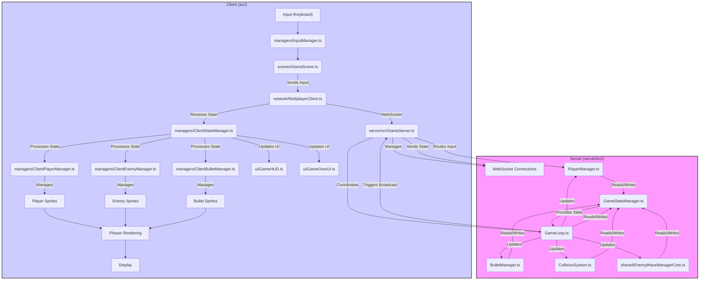
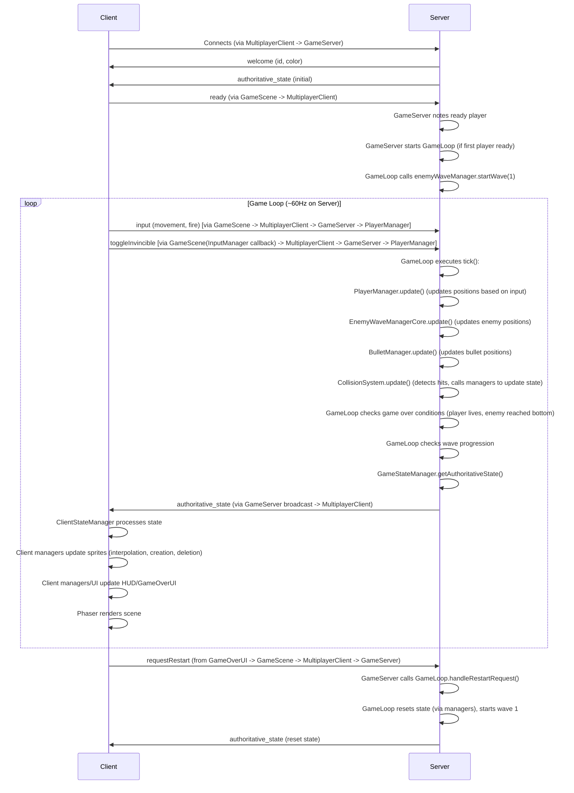

# Comprehensive Game Documentation: Multiplayer Arcade Space Shooter (Post-Refactor)

## 1. Introduction

This document provides comprehensive documentation for the multiplayer arcade space shooter project, updated after a major refactoring effort. It details the game's core functionality, technical architecture, current implementation state, and known issues. The project employs a server-authoritative architecture using Node.js (TypeScript) for the server and Phaser (TypeScript) for the client, ensuring consistency and fairness across all connected clients.

## 2. Core Gameplay

*(No changes to core gameplay description)*

*   **Concept:** A top-down space shooter inspired by classic arcade games.
*   **Player Control:** Players control individual ships, moving horizontally and vertically, and firing projectiles upwards. Input is sent to the server, which determines the authoritative position.
*   **Enemies:** Two primary enemy types exist: NormalEnemy (Type 1) and FalconEnemy (Type 2).
*   **Waves:** Enemies appear in predefined waves, spawned and moved authoritatively by the server.
*   **Objective:** Survive incoming enemy waves and projectiles for as long as possible.
*   **Game Over/Restart:** The game enters a "Game Over" state if either of the following occurs (checked in this order):
    *   *All* connected players have 0 lives (i.e., `isActive` is false for all players).
    *   An enemy reaches the bottom of the screen and *not all* active players are invincible.
    *   **Invincibility Exception:** If an enemy reaches the bottom while *all* active players *are* invincible, the game does *not* end. Instead, the current wave's surviving enemies reset to their original starting Y positions for that wave.
    *   Players with 0 lives become inactive (cannot move/shoot, sprite hidden) but can observe until the game ends. The Game Over UI allows any player to request a server-side game reset.

## 3. Architecture (Post-Refactor)

### 3.1 Server-Authoritative Model Overview

The game employs a server-authoritative architecture. The Node.js server (written in TypeScript, located in `server/src/`) acts as the single source of truth. Logic is modularized into several classes: `GameServer` (manages connections), `GameLoop` (drives updates), `GameStateManager` (holds state), `PlayerManager`, `BulletManager`, `CollisionSystem`, and the shared `EnemyWaveManagerCore` (manages enemy wave state).

Clients (`src/`) primarily send input via `src/network/MultiplayerClient.ts` and render the game world based on state updates received from the server. The main client scene (`src/scenes/GameScene.ts`) acts as an orchestrator, delegating state processing and entity management to various client-side managers (`src/managers/`).

<details open><summary>Mermaid Code (Architecture Overview - Post-Refactor)</summary>



</details>

### 3.2 Server Responsibilities (Distributed)

*   **`GameServer.ts`:** Manages WebSocket connections (`ws` library), assigns player IDs/colors, handles message routing (input, ready, restart) to appropriate managers, initiates state broadcasts.
*   **`GameStateManager.ts`:** Holds the authoritative state (players, bullets, game state enum) using Maps for efficient access. Provides methods to get/set state and serializes the state for broadcasting. Relies on `EnemyWaveManagerCore` for enemy state and wave number.
*   **`PlayerManager.ts`:** Manages player lifecycle (add, remove, reset), updates player state (position based on input, lives, active status, invincibility). Handles `input` and `toggleInvincible` messages. *(Note: Boundary checks currently missing)*.
*   **`BulletManager.ts`:** Manages player and enemy bullets (creation via methods called by other modules, position updates, removal on boundary exit or collision).
*   **`CollisionSystem.ts`:** Performs authoritative AABB collision detection using type-specific dimensions for enemies (`NORMAL_ENEMY_COLLISION_*`, `FALCON_ENEMY_COLLISION_*`) to match client-side scaling. Calls methods on other managers (`PlayerManager`, `BulletManager`, `EnemyWaveManagerCore`) to update state based on collision results (e.g., decrement lives, deactivate enemy/bullet).
*   **`GameLoop.ts`:** Runs the fixed-tick game loop (~60Hz). Orchestrates the update sequence: updates players, enemies (via `EnemyWaveManagerCore`), bullets; handles enemy firing logic (including individual and per-type cooldowns); runs collision detection; checks game over conditions (all players inactive, enemy reached bottom); handles wave progression; triggers state broadcast via `GameServer`.
*   **`shared/EnemyWaveManagerCore.ts`:** Manages enemy spawning, wave state, and basic enemy movement/visibility updates.

### 3.3 Client Responsibilities (Distributed)

*   **`scenes/GameScene.ts`:** Acts as the main orchestrator. Initializes Phaser, connects to the server (`MultiplayerClient`), creates client-side managers and UI components, sets up physics overlaps (delegating handlers to `ClientCollisionEffectsManager`), and manages the main Phaser update loop (calling manager updates, handling local input).
*   **`network/MultiplayerClient.ts`:** Handles WebSocket connection, sending messages (input, ready, restart), receiving messages (welcome, authoritative_state), parsing messages, and invoking callbacks (e.g., `onAuthoritativeState`). Buffers messages until `GameScene` signals readiness. Uses shared types.
*   **`managers/ClientStateManager.ts`:** Receives the `authoritativeState` from `MultiplayerClient`. Reconciles the received state with the local representation by comparing new and old states and instructing other managers (Player, Enemy, Bullet) to create, update, or destroy corresponding sprites/objects. Updates UI components (`GameHUD`, `GameOverUI`) based on state changes (wave number, game state).
*   **`managers/ClientPlayerManager.ts`:** Manages player sprites based on instructions from `ClientStateManager`. Creates/destroys sprites, updates positions (interpolating remote players, directly setting local player), applies visual effects (color tinting, invincibility pulse). Detects player lives decreasing (when not invincible) to trigger hit animations via the `Player` class.
*   **`managers/ClientEnemyManager.ts`:** Manages enemy sprites based on instructions from `ClientStateManager`. Creates/destroys sprites, updates positions (interpolating movement). Detects `active: true -> false` state transitions to trigger explosion effects (`showExplosion`).
*   **`managers/ClientBulletManager.ts`:** Manages bullet sprites based on instructions from `ClientStateManager`. Creates/destroys sprites, updates positions, handles reconciliation of predicted player bullets (using a queue and ID re-mapping), applies visual distinctions (e.g., tint for falcon bullets). Creates predicted local player bullets and includes a cleanup mechanism for orphaned predictions.
*   **`managers/InputManager.ts`:** Captures keyboard input (movement, fire, invincibility toggle). Provides input state to `GameScene`. Invokes a callback provided by `GameScene` when invincibility is toggled.
*   **`managers/ClientCollisionEffectsManager.ts`:** Handles client-side *visual effects* triggered by Phaser's physics overlap events (e.g., bullet hitting player, player hitting enemy). Does *not* modify authoritative state. (Note: Enemy explosion effect on bullet hit is now triggered by `ClientEnemyManager` based on state change).
*   **`ui/GameHUD.ts`:** Displays lives and wave number. Updated by `ClientStateManager`. *(Note: Lives update mechanism needs clarification)*.
*   **`ui/GameOverUI.ts`:** Displays "GAME OVER" and "New Game" button. Visibility controlled by `ClientStateManager`. Button click callback (currently placeholder in `ClientStateManager`) should trigger `requestRestart` message via `MultiplayerClient`.

### 3.4 Shared Logic (`src/shared/`)

*   **`types.ts`:** Defines shared TypeScript interfaces (`PlayerState`, `EnemyState`, `BulletState`, `AuthoritativeState`, message payloads) and enums (`GameStateEnum`) used by both client and server.
*   **`constants.ts`:** Centralizes shared constants (game dimensions, speeds, cooldowns, tick rate).
*   **`logger.ts`:** Provides a conditional logger utility (debug, info, warn, error) controlled by `LOG_LEVEL` environment variable (primarily for server-side).
*   **`EnemyWaveManagerCore.ts`:** Framework-agnostic class managing enemy wave state (spawning, positions, active status). Used directly by the server. *(Note: Currently contains misplaced enemy firing logic that should be moved to a server-specific module)*.

### 3.5 Data Flow / Communication Protocol

<details open><summary>Mermaid Code (Data Flow - Post-Refactor)</summary>



</details>

### 3.6 Class Relationships (Simplified - Post-Refactor)

<details open><summary>Mermaid Code (Class Relationships - Post-Refactor)</summary>

```mermaid
classDiagram
    direction LR

    %% subgraph Server ["Server"] {  -- Removed subgraph grouping
        class GameServer {
            +wss: WebSocketServer
            +clients: Map<WebSocket, PlayerId>
            +handleMessage()
            +broadcastState()
        }
        class GameLoop {
            +startGame()
            +stopGame()
            +tick()
            +handleRestartRequest()
        }
        class GameStateManager {
            +players: Map<PlayerId, PlayerState>
            +playerBullets: Map<EntityId, BulletState>
            +enemyBullets: Map<EntityId, BulletState>
            +gameState: GameStateEnum
            +getAuthoritativeState()
            +addPlayer()
            +removePlayerBullet()
            +setGameState()
        }
        class PlayerManager {
            +addPlayer()
            +removePlayer()
            +update()
            +handleInput()
            +handleToggleInvincible()
            +resetPlayers()
        }
        class BulletManager {
            +createPlayerBullet()
            +createEnemyBullet()
            +update()
            +handlePlayerBulletHit()
            +handleEnemyBulletHit()
            +resetBullets()
        }
        class CollisionSystem {
            +update()
        }
    } %% -- Removed subgraph grouping closing brace

    %% subgraph Client ["Client"] { -- Removed subgraph grouping
        class GameScene {
            +multiplayerClient
            +clientStateManager
            +clientPlayerManager
            +clientEnemyManager
            +clientBulletManager
            +inputManager
            +gameHUD
            +gameOverUI
            +create()
            +update()
        }
        class MultiplayerClient {
            -ws: WebSocket
            +onWelcome
            +onAuthoritativeState
            +sendInput()
            +send()
            +signalReady()
        }
        class ClientStateManager {
            +processStateUpdate()
            +updateUI()
        }
        class ClientPlayerManager {
            +addPlayer()
            +removePlayer()
            +updatePlayer()
            +update()
        }
        class ClientEnemyManager {
            +addEnemy()
            +removeEnemy()
            +updateEnemy()
            +update()
        }
        class ClientBulletManager {
            +addOrUpdatePlayerBullet()
            +addOrUpdateEnemyBullet()
            +removePlayerBullet()
            +removeEnemyBullet()
            +createLocalPredictedBullet()
            +update()
        }
        class ClientCollisionEffectsManager {
            +handleBulletEnemyCollision()
            +handleEnemyBulletPlayerCollision()
            +handlePlayerEnemyCollision()
        }
        class InputManager {
            +getCursorKeys()
            +isFireDown()
        }
        class GameHUD {
            +updateWave()
            +updateLives()
        }
        class GameOverUI {
            +show()
            +hide()
        }
        class Player {
             +sprite
             +setTargetPosition()
             +interpolatePosition()
             +handleInvincibilityEffect()
        }
         class Enemy {
             +sprite
             +setTargetPosition()
             +interpolatePosition()
        }
    } %% -- Removed subgraph grouping closing brace

    %% subgraph Shared ["Shared"] { -- Removed subgraph grouping
        class EnemyWaveManagerCore {
            -enemies: EnemyState[]
            +startWave()
            +update()
            +getEnemies()
            +destroyEnemyById()
            +resetActiveEnemyPositions()
        }
        class logger {
            +info()
            +warn()
            +error()
            +debug()
        }
        interface AuthoritativeState
        interface PlayerState
        interface EnemyState
        interface BulletState
        interface InputPayload
        interface WelcomePayload
        enum GameStateEnum
    } %% -- Removed subgraph grouping closing brace

    GameServer o-- GameLoop
    GameServer o-- GameStateManager
    GameServer o-- PlayerManager
    GameServer o-- BulletManager
    GameServer o-- CollisionSystem
    GameServer o-- EnemyWaveManagerCore

    GameLoop o-- GameStateManager
    GameLoop o-- PlayerManager
    GameLoop o-- BulletManager
    GameLoop o-- CollisionSystem
    GameLoop o-- EnemyWaveManagerCore
    GameLoop ..> GameServer : broadcastCallback

    PlayerManager o-- GameStateManager
    PlayerManager o-- BulletManager : Calls createPlayerBullet

    BulletManager o-- GameStateManager

    CollisionSystem o-- GameStateManager
    CollisionSystem o-- PlayerManager
    CollisionSystem o-- BulletManager
    CollisionSystem o-- EnemyWaveManagerCore

    GameStateManager o-- EnemyWaveManagerCore

    GameScene o-- MultiplayerClient
    GameScene o-- ClientStateManager
    GameScene o-- ClientPlayerManager
    GameScene o-- ClientEnemyManager
    GameScene o-- ClientBulletManager
    GameScene o-- ClientCollisionEffectsManager
    GameScene o-- InputManager
    GameScene o-- GameHUD
    GameScene o-- GameOverUI

    MultiplayerClient ..> ClientStateManager : onAuthoritativeState
    MultiplayerClient ..> GameScene : onWelcome

    ClientStateManager o-- ClientPlayerManager
    ClientStateManager o-- ClientEnemyManager
    ClientStateManager o-- ClientBulletManager
    ClientStateManager o-- GameHUD
    ClientStateManager o-- GameOverUI

    ClientPlayerManager o-- Player : Creates/Manages
    ClientEnemyManager o-- Enemy : Creates/Manages

    GameScene ..> ClientCollisionEffectsManager : Uses handlers

    Server ..> Shared : Uses
    Client ..> Shared : Uses

```

</details>

## 4. Key Components & Logic (Post-Refactor)

### 4.1 Player

| Feature          | Description                                                                                                                               | Location(s)                                                                 |
| :--------------- | :---------------------------------------------------------------------------------------------------------------------------------------- | :-------------------------------------------------------------------------- |
| **Sprite**       |  Represents the player ship.                                                                      | `assets/player_ship.svg`                                                    |
| **State (Server)** | `id`, `color`, `x`, `y`, `lives`, `isActive`, `isInvincible`, `lastShotTime`, `lastEnemyCollisionTime`. Managed in `GameStateManager` (`players` Map). | `server/src/GameStateManager.ts`, `src/shared/types.ts` (`PlayerState`)     |
| **Rendering (Client)** | Sprite created/updated by `ClientPlayerManager` based on `ClientStateManager` processing server state. Remote players interpolated, local player position set directly. Color fallback for dark colors. Invincibility effect (pulse) and hit animation (flash) applied via `Player` class. | `src/player/Player.ts`, `src/managers/ClientPlayerManager.ts`               |
| **Input**        | Client (`InputManager`) captures keyboard input. `GameScene` reads state from `InputManager` and sends `input` message via `MultiplayerClient` if player `isActive`. `InputManager` callback triggers `toggleInvincible` message via `GameScene`. | `src/managers/InputManager.ts`, `src/scenes/GameScene.ts`, `src/network/MultiplayerClient.ts` |
| **Movement**     | Server (`PlayerManager`) updates `x`, `y` for active players based on last received `input`. Client (`ClientPlayerManager`) interpolates remote players. Input ignored for inactive players. *(Server boundary checks missing)* | `server/src/PlayerManager.ts`, `src/managers/ClientPlayerManager.ts`          |
| **Shooting**     | Client (`GameScene`) predicts bullet locally via `ClientBulletManager`. `GameScene` sends `fire` input. Server (`PlayerManager` checks input and cooldown, calls `BulletManager.createPlayerBullet` via injected dependency if player `isActive`). | `src/scenes/GameScene.ts`, `src/managers/ClientBulletManager.ts`, `server/src/PlayerManager.ts`, `server/src/BulletManager.ts` |
| **Collision**    | Server (`CollisionSystem`) detects collisions. Server (`PlayerManager`) checks `isInvincible` and player-enemy collision cooldown (`lastEnemyCollisionTime`, `PLAYER_ENEMY_COLLISION_COOLDOWN`) before decrementing `lives` and updating `isActive`. Client (`ClientCollisionEffectsManager`) shows local effects for bullet/player hits. Client (`ClientPlayerManager`) triggers hit animation based on lives decrease. | `server/src/CollisionSystem.ts`, `server/src/PlayerManager.ts`, `src/managers/ClientCollisionEffectsManager.ts`, `src/managers/ClientPlayerManager.ts` |
| **Invincibility**| Triggered by CTRL key (client `InputManager`). `GameScene` sends `toggleInvincible` message. Server (`PlayerManager`) toggles `isInvincible` state. Server (`CollisionSystem`) ignores damage if `isInvincible`. Client (`ClientPlayerManager` via `Player`) applies pulsating alpha tween. | `src/managers/InputManager.ts`, `src/scenes/GameScene.ts`, `server/src/PlayerManager.ts`, `server/src/CollisionSystem.ts`, `src/player/Player.ts` |
| **Defeat**       | When `lives` reaches 0, server (`PlayerManager`) sets `isActive` to false. Client (`ClientPlayerManager`) hides sprite. `ClientStateManager` might show "Waiting..." text (logic TBD). Input blocked by `GameScene`. | `server/src/PlayerManager.ts`, `src/managers/ClientPlayerManager.ts`, `src/managers/ClientStateManager.ts` |

### 4.2 Enemies

#### 4.2.1 NormalEnemy (Type 1) & 4.2.2 FalconEnemy (Type 2)

| Feature          | Description                                                                                                                               | Location(s)                                                                 |
| :--------------- | :---------------------------------------------------------------------------------------------------------------------------------------- | :-------------------------------------------------------------------------- |
| **Sprite**       |                                                          | `assets/enemy_ship.svg`, `assets/enemy_falcon.svg`                          |
| **State (Server)** | `id`, `type`, `x`, `y`, `active`, `visible`, `startY`. Managed by `EnemyWaveManagerCore` instance held by `GameStateManager`.               | `src/shared/EnemyWaveManagerCore.ts`, `server/src/GameStateManager.ts`      |
| **Spawning**     | Server (`EnemyWaveManagerCore`) spawns in a grid at wave start.                                                                           | `src/shared/EnemyWaveManagerCore.ts`                                        |
| **Movement**     | Server (`EnemyWaveManagerCore`) updates `y` position downwards. Client (`ClientEnemyManager`) interpolates sprite position.                 | `src/shared/EnemyWaveManagerCore.ts`, `src/managers/ClientEnemyManager.ts`  |
| **Shooting**     | Server (`GameLoop.ts` in `handleEnemyFiring`) decides firing based on individual enemy cooldowns (`ENEMY_SHOOT_INTERVAL_*`), a per-type cooldown (`ENEMY_TYPE_SHOOT_COOLDOWN`), and a probability check. Calls `BulletManager.createEnemyBullet`. | `server/src/GameLoop.ts`, `server/src/BulletManager.ts` (Creation method), `src/shared/constants.ts` (Cooldowns) |
| **Collision**    | Server (`CollisionSystem`) detects collisions with player bullets and player using type-specific hitboxes. Calls `EnemyWaveManagerCore.destroyEnemyById` on bullet hit. Client (`ClientEnemyManager`) triggers explosion effect based on `active: false` state change. | `server/src/CollisionSystem.ts`, `src/shared/EnemyWaveManagerCore.ts`, `src/managers/ClientEnemyManager.ts` |
| **Rendering (Client)** | Sprites created/updated by `ClientEnemyManager`. Scaling applied in constructors (`NormalEnemy`: 0.25, `FalconEnemy`: 0.5). `sprite.refreshBody()` called after scaling. Interpolation smooths movement. Server collision logic uses corresponding scaled dimensions. | `src/enemies/NormalEnemy.ts`, `src/enemies/FalconEnemy.ts`, `src/managers/ClientEnemyManager.ts`, `server/src/CollisionSystem.ts`, `src/shared/constants.ts` |

### 4.3 Bullets (Player & Enemy)

| Feature          | Description                                                                                                                               | Location(s)                                                                 |
| :--------------- | :---------------------------------------------------------------------------------------------------------------------------------------- | :-------------------------------------------------------------------------- |
| **Sprite**       |  Projectile sprite.                                                                                    | `assets/bullet.svg`                                                         |
| **State (Server)** | `id`, `ownerId`, `x`, `y`, `velocityX`, `velocityY`, `bulletType`. Managed in `GameStateManager` (`playerBullets`, `enemyBullets` Maps). | `server/src/GameStateManager.ts`, `src/shared/types.ts` (`BulletState`)     |
| **Synchronization**| Player bullets: Client predicts locally (`ClientBulletManager` creates sprite with temp ID, adds ID to queue), server creates authoritatively (`BulletManager`). Client reconciles (`ClientBulletManager` dequeues predicted ID, updates existing sprite, re-maps ID). Orphaned predictions cleaned up via timer. Enemy bullets: Server creates (`BulletManager`), client creates/updates (`ClientBulletManager`). Client applies tint based on `bulletType`. | `src/managers/ClientBulletManager.ts`, `server/src/BulletManager.ts`        |
| **Movement**     | Server (`BulletManager`) updates `x`, `y` based on velocity. Client (`ClientBulletManager`) updates sprite positions based on server state (potentially with interpolation). | `server/src/BulletManager.ts`, `src/managers/ClientBulletManager.ts`        |
| **Lifecycle**    | Server (`BulletManager`) removes bullets when out of bounds or after collision (via `CollisionSystem` call). Client (`ClientBulletManager`) removes sprites when ID disappears from server state or on local collision effect. | `server/src/BulletManager.ts`, `server/src/CollisionSystem.ts`, `src/managers/ClientBulletManager.ts` |

### 4.4 Collision Handling

*   Primary collision detection is performed server-side by `CollisionSystem` using AABB checks. Uses type-specific dimensions for enemies (`NORMAL_ENEMY_COLLISION_*`, `FALCON_ENEMY_COLLISION_*` in `shared/constants.ts`) matching client scaling.
*   `CollisionSystem` calls methods on `PlayerManager`, `BulletManager`, and `EnemyWaveManagerCore` to update the authoritative state in `GameStateManager` based on collisions. `PlayerManager` enforces player-enemy collision cooldowns.
*   The client's `ClientCollisionEffectsManager` uses Phaser's `overlap` checks to trigger local visual effects for player/bullet hits. Enemy explosions are triggered by `ClientEnemyManager` based on state changes. Client does not modify authoritative game state.

### 4.5 State Synchronization

*   The server (`GameServer` via `GameLoop` callback) broadcasts the full authoritative state (`AuthoritativeState`) from `GameStateManager` at ~60Hz.
*   Clients (`ClientStateManager`) receive the state and perform ID-based reconciliation for players, enemies, and bullets, instructing the respective managers (`ClientPlayerManager`, `ClientEnemyManager`, `ClientBulletManager`) to create, update, or destroy sprites.
*   Client-side interpolation (`Phaser.Math.Linear`) is used by `ClientPlayerManager` and `ClientEnemyManager` to smooth movement between server updates.
*   Client-side prediction for locally fired player bullets uses a queue in `ClientBulletManager`. `GameScene` initiates prediction, `ClientBulletManager` creates the sprite and queues the temporary ID. Upon receiving the corresponding authoritative bullet state from the server, `ClientBulletManager` dequeues the ID and reconciles the existing sprite. A cleanup mechanism removes orphaned predicted sprites that fail reconciliation.

### 4.6 UI Components

*   **`GameHUD`:** Displays lives and wave number. Created by `GameScene`, updated by `ClientStateManager` based on authoritative state. *(Lives update needs clarification)*. Positioned at the top (y=20).
*   **`GameOverUI`:** Displays "GAME OVER" and "New Game" button. Created by `GameScene`. Visibility controlled by `ClientStateManager` based on server `gameState`. Button click should trigger `requestRestart` message.
*   **Waiting Text:** *(Currently not explicitly implemented)* Could be added in `ClientStateManager` or `ClientPlayerManager` when local player `isActive` is false but `gameState` is 'playing'.

### 4.7 Wave Progression

*   Handled entirely server-side within `GameLoop`.
*   Checks if all enemies in the current wave are inactive (`enemies.every(e => !e.active)` via `EnemyWaveManagerCore`).
*   If true, increments wave number (managed by `EnemyWaveManagerCore`) and calls `enemyWaveManager.startWave()` to spawn the next wave.
*   The new `waveNumber` is included in the broadcasted state via `GameStateManager`.

### 4.8 Game Start/Reset Flow

*   **Start:** Server (`GameServer`) waits for the first player to connect and send a `ready` message before calling `gameLoop.startGame()`. `GameLoop` then calls `enemyWaveManager.startWave(1)` and starts the tick interval.
*   **Reset:** Client sends `requestRestart` message (triggered by `GameOverUI`). Server (`GameServer`) receives message, calls `gameLoop.handleRestartRequest()`. `GameLoop` verifies game is over, calls its `resetGame()` method (which resets players via `PlayerManager` and bullets via `BulletManager`, sets state to 'playing' via `GameStateManager`), and then calls `enemyWaveManager.startWave(1)`. The reset state is broadcast.

## 5. Code Structure (Post-Refactor)

*   **`server/src/`:** Contains server-side TypeScript code.
    *   **`GameServer.ts`:** WebSocket connection management, message routing.
    *   **`GameLoop.ts`:** Main server update loop orchestration.
    *   **`GameStateManager.ts`:** Authoritative state storage.
    *   **`PlayerManager.ts`:** Player logic and state updates.
    *   **`BulletManager.ts`:** Bullet logic and state updates.
    *   **`CollisionSystem.ts`:** Collision detection logic.
*   **`src/`:** Contains client-side Phaser (TypeScript) code.
    *   **`index.ts`:** Phaser game initialization.
    *   **`scenes/`:** `SplashScene.ts`, `GameScene.ts` (main client orchestrator).
    *   **`managers/`:** Client-side logic managers (`ClientStateManager`, `ClientPlayerManager`, `ClientEnemyManager`, `ClientBulletManager`, `ClientCollisionEffectsManager`, `InputManager`).
    *   **`network/`:** WebSocket wrapper (`MultiplayerClient.ts`).
    *   **`player/`:** `Player.ts` class (visual representation).
    *   **`enemies/`:** `Enemy.ts` (base), `NormalEnemy.ts`, `FalconEnemy.ts` (visual representations).
    *   **`ui/`:** `GameHUD.ts`, `GameOverUI.ts`.
    *   **`effects/`:** `effects.ts` (e.g., `showExplosion`).
*   **`src/shared/`:** Framework-agnostic code shared between client and server.
    *   **`types.ts`:** Shared interfaces and types.
    *   **`constants.ts`:** Shared constant values.
    *   **`logger.ts`:** Conditional logging utility.
    *   **`EnemyWaveManagerCore.ts`:** Shared enemy wave state logic.
*   **`assets/`:** Contains SVG images for sprites.
*   **`dist/`:** Contains compiled JavaScript output (client bundle and server files).

## 6. Current Status & Known Issues (Post-Refactor)

*   The game implements a modular, server-authoritative architecture using TypeScript.
*   Server logic is distributed across specialized manager classes.
*   Client logic is managed by dedicated client-side managers, orchestrated by `GameScene`.
*   State synchronization uses ID-based reconciliation, interpolation, and queue-based client-side prediction for player bullets.
*   Conditional logging is implemented and configurable via Webpack for the client.
*   **Known Issues/Areas for Review:**
    *   **Missing Server Logic:** Player boundary checks are not implemented in `server/src/PlayerManager.ts`.
    *   **Unclear Client Logic:** The exact mechanism for updating the `GameHUD` lives display needs clarification (Currently updated in `GameScene`'s `onAuthoritativeState` callback, but could be centralized).
    *   Interpolation logic (`ClientPlayerManager`, `ClientEnemyManager`) might require further tuning for optimal smoothness.

## 7. Appendices

*(Placeholder - Can add detailed message formats or glossary if needed)*