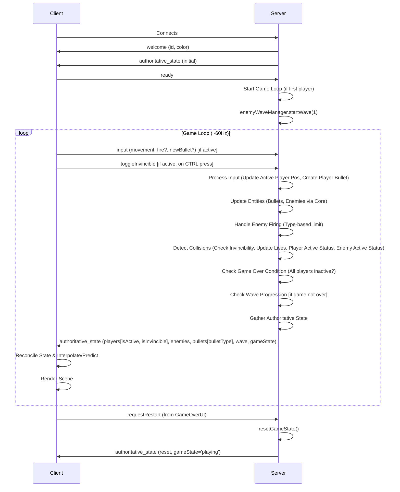
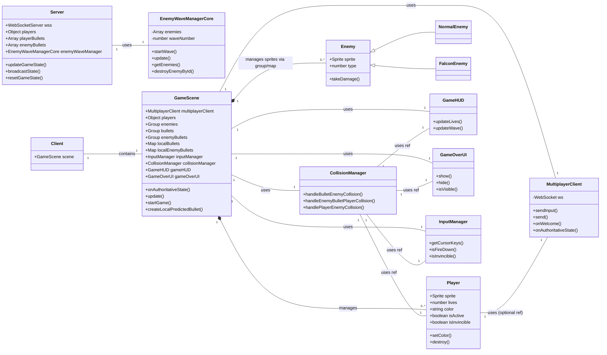

# Comprehensive Game Documentation: Multiplayer Arcade Space Shooter

## 1. Introduction

This document provides comprehensive documentation for the multiplayer arcade space shooter project. It details the game's core functionality, technical architecture, current implementation state, and known issues. The project began as a single-player game and evolved into a real-time multiplayer experience featuring a server-authoritative architecture, ensuring consistency and fairness across all connected clients.

## 2. Core Gameplay

*   **Concept:** A top-down space shooter inspired by classic arcade games.
*   **Player Control:** Players control individual ships, moving horizontally and vertically, and firing projectiles upwards. Input is sent to the server, which determines the authoritative position.
*   **Enemies:** Two primary enemy types exist: NormalEnemy (Type 1) and FalconEnemy (Type 2).
*   **Waves:** Enemies appear in predefined waves, spawned and moved authoritatively by the server.
*   **Objective:** Survive incoming enemy waves and projectiles for as long as possible.
*   **Game Over/Restart:** The game enters a "Game Over" state if either of the following occurs (checked in this order):
    *   *All* connected players have 0 lives (i.e., `isActive` is false for all players).
    *   An enemy reaches the bottom of the screen and *not all* active players are invincible.
    *   **Invincibility Exception:** If an enemy reaches the bottom while *all* active players *are* invincible, the game does *not* end. Instead, the current wave's surviving enemies reset to their original starting Y positions for that wave.
    *   Players with 0 lives become inactive (cannot move/shoot, sprite hidden) but can observe until the game ends. The Game Over UI allows any player to request a server-side game reset.

## 3. Architecture

### 3.1 Server-Authoritative Model Overview

The game employs a server-authoritative architecture. The Node.js server (`server/server.js`) acts as the single source of truth for all critical game state and logic. Clients (`src/scenes/GameScene.ts`) primarily send input to the server and render the game world based on the state updates received from the server. Shared, framework-agnostic logic for enemy wave management is located in `src/shared/EnemyWaveManagerCore.ts`.

Mermaid Code (Architecture Overview)

### 3.2 Server Responsibilities (`server/server.js`)

*   Manages WebSocket connections.
*   Assigns unique IDs and colors to connecting players. Sends initial state to the new player and broadcasts the updated state (including the new player) to all clients immediately upon connection.
*   Maintains the authoritative state: `players` (including `lives`, `isActive`, `isInvincible`, `lastEnemyCollisionTime`), `playerBullets`, `enemyBullets` (including `bulletType`), enemy state (via `EnemyWaveManagerCore`), `waveNumber`, `gameState` ('playing' or 'gameOver'). Uses game dimensions `GAME_WIDTH=1024`, `GAME_HEIGHT=768`.
*   Listens for client messages: `input` (movement/firing), `ready` (to start game), `requestRestart`.
*   Runs a fixed-tick game loop (`updateGameState` at ~60Hz):
    *   Updates active player positions based on last received input (ignores input from inactive players).
    *   Creates player bullets based on `fire` input from active players.
    *   Updates all bullet positions and removes out-of-bounds bullets.
    *   Updates enemy state (position, visibility) via `EnemyWaveManagerCore.update()`.
    *   Handles enemy firing logic, enforcing a limit of one shot per enemy type per second across all enemies.
    *   Performs collision detection, checking player invincibility and a 500ms cooldown (`lastEnemyCollisionTime`) before applying damage from player-enemy collisions.
    *   Updates entity states based on collisions (player `lives`, `isActive`, `lastEnemyCollisionTime`, enemy `active`).
    *   Checks if all players are inactive (due to lives) and sets `gameState` to 'gameOver' if true. This check occurs immediately after collision processing.
    *   If the game is still playing, checks if an enemy reached the bottom. If so, checks player invincibility status: sets `gameState` to 'gameOver' if not all active players are invincible, or calls `enemyWaveManager.resetActiveEnemyPositions()` if they are.
    *   Handles wave progression via `EnemyWaveManagerCore` if `gameState` is 'playing'.
*   Broadcasts the complete `authoritativeState` to all clients regularly.
*   Handles game state resets on `requestRestart` (resets `gameState`, player `lives`/`isActive`, bullets, wave).

### 3.3 Client Responsibilities (`src/scenes/GameScene.ts`)

*   Connects to the server via WebSocket (`MultiplayerClient`).
*   Sends `ready` message after splash screen.
*   Sends `input` messages (movement, fire, predicted bullet details) to the server if the local player is active.
*   Sends `toggleInvincible` message when CTRL key is pressed if the local player is active.
*   Receives `authoritativeState` messages from the server.
*   Reconciles local game objects with the server state:
    *   Creates/updates/destroys player sprites (interpolating remote players, directly setting local player).
    *   Creates/updates/destroys enemy sprites (interpolating movement).
    *   Reconciles player bullets (correcting predicted bullets, creating/destroying others).
    *   Reconciles enemy bullets, applying an orange tint to sprites identified with `bulletType: 'falcon'`.
*   Renders the game world (1024x768) based on the reconciled state.
*   Updates UI elements (`GameHUD`) based on received state.
*   Displays "Waiting..." text if the local player is inactive (`isActive: false`) but the overall `gameState` is 'playing'.
*   Displays `GameOverUI` only when the server's `gameState` is 'gameOver'. Sends `requestRestart` on button click.
*   Applies a pulsating visual effect to the local player sprite when `isInvincible` is true in the server state.
*   Manages client-side managers (`InputManager`, `CollisionManager`, `EnemyWaveManager` adapter, `GameHUD`, `GameOverUI`).
*   Handles client-side prediction for locally fired bullets.

### 3.4 Shared Logic (`src/shared/EnemyWaveManagerCore.ts`)

*   Framework-agnostic TypeScript class.
*   Manages the core state and logic for enemy waves.
*   `startWave`: Spawns enemies in a 7x3 grid formation, centered horizontally within the 1024px viewport (between HUD elements). Assigns unique IDs, random types, and stores initial `startY`.
*   `update`: Accepts `gameHeight` parameter. Moves active enemies vertically, updates `visible` status based on position and `gameHeight`. Handles basic bullet logic using `gameHeight` for bounds. (Note: Server `server.js` contains the actual enemy firing logic).
*   `destroyEnemyById`: Marks an enemy as inactive.
*   `resetActiveEnemyPositions`: Resets the `y` position of all active enemies to their original `startY`. Used by the server when enemies reach the bottom while players are invincible.
*   Used directly by the server for simulation.
*   Instantiated by the client's `EnemyWaveManager` adapter (though the adapter's update/spawn methods are largely bypassed in favor of server state).

### 3.5 Data Flow / Communication Protocol

Mermaid Code (Data Flow)

### 3.6 Class Relationships (Simplified)

Mermaid Code (Class Relationships)

## 4. Key Components & Logic

### 4.1 Player

| Feature          | Description                                                                                                                               | Location(s)                                     |
| :--------------- | :---------------------------------------------------------------------------------------------------------------------------------------- | :---------------------------------------------- |
| **Sprite**       |  Represents the player ship.                                                                      | `assets/player_ship.svg`                        |
| **State (Server)** | `id`, `color`, `x`, `y`, `lives`, `isActive`, `isInvincible`, `invincibleUntil`, `velocityX`, `velocityY`, `lastInputTime`, `input`, `lastShotTime`. Managed in `server.js` `players` object. | `server.js`                                     |
| **Rendering (Client)** | Sprite created/updated in `GameScene` based on server state. Sprites are scaled to 0.4x with a 16x16 physics body in `Player` constructor. Remote players interpolated, local player position set directly. Color fallback for dark colors. | `src/player/Player.ts`, `src/scenes/GameScene.ts` |
| **Input**        | Client (`InputManager`, `GameScene`) captures keyboard input. `GameScene` sends `input` message if player `isActive`. `InputManager` toggles local invincibility state on CTRL press; `GameScene` detects this change and sends `toggleInvincible` message to server if player `isActive`. | `src/managers/InputManager.ts`, `src/scenes/GameScene.ts` |
| **Movement**     | Server (`server.js`) updates `x`, `y` for active players based on last received `input`. Client interpolates remote players. Input ignored for inactive players. | `server.js`, `src/scenes/GameScene.ts`          |
| **Shooting**     | Client predicts bullet locally. `GameScene` sends details in `input` message if player `isActive`. Server creates bullet authoritatively if player `isActive`, applies cooldown (300ms). Input ignored for inactive players. | `src/scenes/GameScene.ts`, `server.js`          |
| **Collision**    | Server (`server.js`) detects collisions. Checks `isInvincible` and 500ms cooldown before decrementing `lives` on player-enemy collision. Updates `isActive` based on `lives`. Client (`CollisionManager`) shows local effects. | `server.js`, `src/managers/CollisionManager.ts` |
| **Invincibility**| Triggered by CTRL key (client `InputManager`). Client `GameScene` sends `toggleInvincible` message to server upon each press. Server toggles the `isInvincible` state based on the message. Server ignores damage if `isInvincible`. Client `GameScene` applies pulsating alpha tween when `isInvincible`. | `src/managers/InputManager.ts`, `src/scenes/GameScene.ts`, `server.js` |
| **Defeat**       | When `lives` reaches 0, server sets `isActive` to false. Client (`GameScene`) hides the player sprite and shows "Waiting..." text if game is ongoing. Input is blocked. | `server.js`, `src/scenes/GameScene.ts`          |

### 4.2 Enemies

#### 4.2.1 NormalEnemy (Type 1)

| Feature          | Description                                                                                                                               | Location(s)                                     |
| :--------------- | :---------------------------------------------------------------------------------------------------------------------------------------- | :---------------------------------------------- |
| **Sprite**       |  Standard enemy ship.                                                                        | `assets/enemy_ship.svg`                         |
| **State (Server)** | `id`, `type: 1`, `x`, `y`, `active`, `visible`, `lastShotTime`. Managed by `EnemyWaveManagerCore` instance within `server.js`.             | `src/shared/EnemyWaveManagerCore.ts`, `server.js` |
| **Spawning**     | Server (`EnemyWaveManagerCore`) spawns in a grid at wave start.                                                                           | `src/shared/EnemyWaveManagerCore.ts`            |
| **Movement**     | Server (`EnemyWaveManagerCore`) updates `y` position downwards (speed 20). Client interpolates.                                           | `src/shared/EnemyWaveManagerCore.ts`, `src/scenes/GameScene.ts` |
| **Shooting**     | Server (`server.js`) fires single downward bullet periodically (`ENEMY_SHOOT_INTERVAL` ~1500ms) if active, visible, and the type-based cooldown (1 per type/sec) allows. Bullet speed `ENEMY_BULLET_SPEED` (200). | `server.js`                                     |
| **Collision**    | Server (`server.js`) detects collisions with player bullets and player. Client (`CollisionManager`) shows local effects.                  | `server.js`, `src/managers/CollisionManager.ts` |

#### 4.2.2 FalconEnemy (Type 2)

| Feature          | Description                                                                                                                               | Location(s)                                     |
| :--------------- | :---------------------------------------------------------------------------------------------------------------------------------------- | :---------------------------------------------- |
| **Sprite**       |  Faster, spread-shot enemy.                                                                | `assets/enemy_falcon.svg`                       |
| **State (Server)** | `id`, `type: 2`, `x`, `y`, `active`, `visible`, `lastShotTime`. Managed by `EnemyWaveManagerCore` instance within `server.js`.             | `src/shared/EnemyWaveManagerCore.ts`, `server.js` |
| **Spawning**     | Server (`EnemyWaveManagerCore`) spawns randomly (30% chance) in grid at wave start.                                                       | `src/shared/EnemyWaveManagerCore.ts`            |
| **Movement**     | Server (`EnemyWaveManagerCore`) updates `y` position downwards (speed 20). Client interpolates.                                           | `src/shared/EnemyWaveManagerCore.ts`, `src/scenes/GameScene.ts` |
| **Shooting**     | Server (`server.js`) fires two bullets in a spread periodically (`ENEMY_SHOOT_INTERVAL * 2` ~3000ms) if active, visible, and the type-based cooldown (1 per type/sec) allows. Bullet speed `ENEMY_BULLET_SPEED * 1.5` (300). | `server.js`                                     |
| **Collision**    | Server (`server.js`) detects collisions with player bullets and player. Client (`CollisionManager`) shows local effects.                  | `server.js`, `src/managers/CollisionManager.ts` |

### 4.3 Bullets (Player & Enemy)

| Feature          | Description                                                                                                                               | Location(s)                                     |
| :--------------- | :---------------------------------------------------------------------------------------------------------------------------------------- | :---------------------------------------------- |
| **Sprite**       |  Projectile sprite.                                                                                    | `assets/bullet.svg`                             |
| **State (Server)** | `id`, `ownerId`, `x`, `y`, `velocityX`, `velocityY`. For enemy bullets, also includes `bulletType` ('normal' or 'falcon'). Managed in `playerBullets` and `enemyBullets` arrays in `server.js`. | `server.js`                                     |
| **Synchronization**| Player bullets: Client predicts, server reconciles using ID. Enemy bullets: Server authoritative, client reconciles using ID. Client (`GameScene`) applies orange tint to sprites if `bulletType` is 'falcon'. | `src/scenes/GameScene.ts`, `server.js`          |
| **Movement**     | Server (`server.js`) updates `x`, `y` based on velocity.                                                                                  | `server.js`                                     |
| **Lifecycle**    | Server (`server.js`) removes bullets when out of bounds or after collision. Client removes sprites when ID disappears from server state.   | `server.js`, `src/scenes/GameScene.ts`          |

### 4.4 Collision Handling

*   All primary collision detection (Player Bullet vs Enemy, Enemy Bullet vs Player, Enemy vs Player) is performed server-side in `server.js` using AABB checks with fixed dimensions (Player: 40x40, Enemy: 40x40, Bullet: 8x16).
*   The server updates the authoritative state based on collisions (e.g., sets `enemy.active = false`, decrements `player.lives` only if not invincible and cooldown allows for player-enemy hits, updates `player.isActive` and `player.lastEnemyCollisionTime`).
*   The client's `CollisionManager` uses Phaser's `overlap` checks primarily to trigger local visual effects (explosions via `showExplosion`) and update the local HUD lives display for immediate feedback. Client-side invincibility checks were removed from handlers to ensure effects trigger correctly. It no longer triggers the game over UI.

### 4.5 State Synchronization

*   The server broadcasts the full authoritative state (`players` [including `isActive`, `isInvincible`], `enemies`, `playerBullets`, `enemyBullets` [including `bulletType`], `waveNumber`, `gameState`) at ~60Hz.
*   Clients use ID-based reconciliation for players, enemies, and bullets:
    *   Existing objects are updated (position, visibility, etc.).
    *   New objects are created.
    *   Objects no longer in the server state are destroyed locally.
*   Client-side interpolation (`Phaser.Math.Linear`) is used in `GameScene.update` to smooth the movement of remote players and enemies between server updates. Player visibility is handled directly in `onAuthoritativeState` based on the server's `isActive` flag, not within the interpolation logic.
*   Client-side prediction is used for locally fired player bullets for immediate feedback.

### 4.6 UI Components

*   **`GameHUD`:** Displays current lives and wave number. Created once and updated by `GameScene` based on authoritative state from the server. Positioned at the top of the screen (y=20).
*   **`GameOverUI`:** Displays "GAME OVER" and "New Game" button. Now shown by `GameScene` only when the server's `gameState` is 'gameOver'. Clicking "New Game" sends `requestRestart` message to the server.
*   **Waiting Text:** A simple text element managed by `GameScene`, shown when the local player is inactive (`isActive: false`) but the overall `gameState` is still 'playing'.

### 4.7 Wave Progression

*   Handled entirely server-side (`server.js`).
*   Checks if all enemies in the current wave are inactive (`enemies.every(e => !e.active)`).
*   If true, increments wave number and calls `enemyWaveManager.startWave()` to spawn the next wave.
*   The new `waveNumber` is included in the broadcasted state.

### 4.8 Game Start/Reset Flow

*   **Start:** Server waits for the first player to connect and send a `ready` message before calling `enemyWaveManager.startWave(1)` and setting `gameStarted = true`.
*   **Reset:** Client sends `requestRestart` message via `GameOverUI`. Server receives message, calls `resetGameState()` (resets `gameState` to 'playing', player `lives`/`isActive`, clears bullets, calls `enemyWaveManager.startWave(1)`), and broadcasts the reset state.

## 5. Code Structure

*   **`server/server.js`:** Contains all server-side logic (WebSocket handling, game loop, state management, collision, etc.).
*   **`src/`:** Contains client-side Phaser code.
    *   **`index.ts`:** Phaser game initialization.
    *   **`scenes/`:** `SplashScene.ts`, `GameScene.ts` (main client logic).
    *   **`shared/`:** Framework-agnostic core logic (`EnemyWaveManagerCore.ts`).
    *   **`managers/`:** Client-side helper classes (`CollisionManager.ts`, `EnemyWaveManager.ts` adapter, `InputManager.ts`).
    *   **`network/`:** WebSocket wrapper (`MultiplayerClient.ts`).
    *   **`player/`:** `Player.ts` class.
    *   **`enemies/`:** `Enemy.ts` (base), `NormalEnemy.ts`, `FalconEnemy.ts`.
    *   **`ui/`:** `GameHUD.ts`, `GameOverUI.ts`.
    *   **`effects/`:** `effects.ts` (e.g., `showExplosion`).
*   **`assets/`:** Contains SVG images for sprites.

## 6. Current Status & Known Issues

*   The game implements a functional server-authoritative architecture.
*   Client-side prediction for player bullets and interpolation for remote entities are in place.
*   Server handles core game logic including collisions and wave progression.
*   **Known Issues/Areas for Review:**
    *   Interpolation logic might require further tuning (`interpDuration`) for optimal smoothness under varying network conditions.
    *   The `falconBullets` group in `GameScene` appears redundant now that enemy bullets are reconciled centrally with type information. Consider removing it.

## 7. Appendices

*(Placeholder - Can add detailed message formats or glossary if needed)*